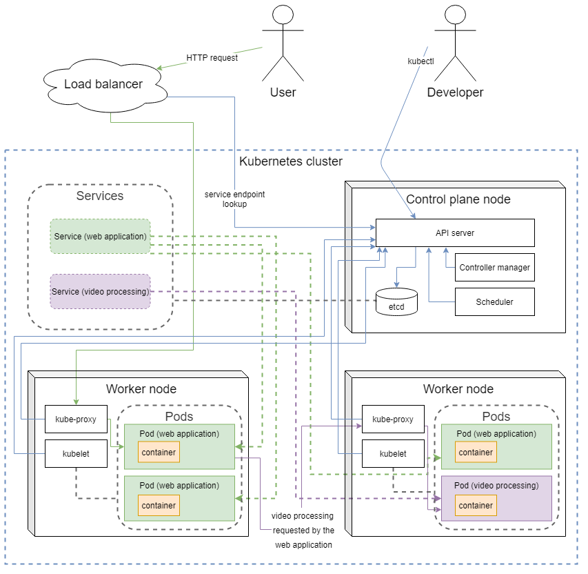

# 3.1

```sh
heroku labs:enable --app=uh-deployment-pipeline runtime-new-layer-extract
```

[uh-deployment-pipeline](https://github.com/kekalainen/uh-deployment-pipeline)

# 3.2

[uh-dockerfile-builder](https://github.com/kekalainen/uh-dockerfile-builder)

# 3.3

`example-frontend/Dockerfile`

```dockerfile
FROM node:14-slim
RUN npm i -g serve
COPY . .
RUN npm ci
RUN npm run build
EXPOSE 5000
RUN useradd appuser
USER appuser
CMD serve -s -l 5000 build
```

`example-backend/Dockerfile`

```dockerfile
FROM golang:1.16-alpine
WORKDIR /go/src/app
COPY . .
RUN go build
EXPOSE 8080
RUN adduser -D appuser
USER appuser
CMD ./server
```

```sh
kekalainen@Z97:~/material-applications$ docker exec -it material-applications_backend_1 sh
/go/src/app $ whoami
appuser
/go/src/app $ exit
kekalainen@Z97:~/material-applications$ docker exec -it material-applications_frontend_1 sh
$ whoami
appuser
```

# 3.4

Initial image sizes:

```sh
kekalainen@Z97:~/material-applications$ docker images | grep material
material-applications_backend                   latest         d27960a2e62f   19 minutes ago   447MB
material-applications_frontend                  latest         bcc859df1d58   21 minutes ago   393MB
```

New Dockerfiles and image sizes:

`example-frontend/Dockerfile`

```dockerfile
FROM node:14-slim
COPY . .
RUN npm i -g serve && npm ci && npm run build && rm -rf ./node_modules && useradd appuser
EXPOSE 5000
USER appuser
CMD serve -s -l 5000 build
```

`example-backend/Dockerfile`

```dockerfile
FROM golang:1.16-alpine
WORKDIR /go/src/app
COPY . .
EXPOSE 8080
RUN go build && adduser -D appuser
USER appuser
CMD ./server
```

```sh
kekalainen@Z97:~/material-applications$ docker images | grep material
material-applications_frontend                  latest         a93be0405f3f   4 minutes ago    211MB
material-applications_backend                   latest         82f563b4a714   12 minutes ago   447MB
```

# 3.5

Image sizes with the parent images `node` and `golang`:

`example-frontend/Dockerfile`

```dockerfile
FROM node
COPY . .
RUN npm i -g serve && npm ci && npm run build && rm -rf ./node_modules && useradd appuser
EXPOSE 5000
USER appuser
CMD serve -s -l 5000 build
```

`example-backend/Dockerfile`

```dockerfile
FROM golang
WORKDIR /go/src/app
COPY . .
EXPOSE 8080
RUN go build && adduser -D appuser
USER appuser
CMD ./server
```

```sh
kekalainen@Z97:~/material-applications$ docker images | grep material
material-applications_backend                   latest         18d45541bfbe   50 seconds ago       1.01GB
material-applications_frontend                  latest         423bc6a14eee   About a minute ago   964MB
```

Image sizes with more lightweight parent image variants:

`example-frontend/Dockerfile`

```dockerfile
FROM node:14-alpine
COPY . .
RUN npm i -g serve && npm ci && npm run build && rm -rf ./node_modules && adduser -D appuser
EXPOSE 5000
USER appuser
CMD serve -s -l 5000 build
```

`example-backend/Dockerfile`

```dockerfile
FROM golang:1.16-alpine
WORKDIR /go/src/app
COPY . .
EXPOSE 8080
RUN go build && adduser -D appuser
USER appuser
CMD ./server
```

```sh
kekalainen@Z97:~/material-applications$ docker images | grep material
material-applications_frontend                  latest         5e72b29f4be9   58 seconds ago      160MB
material-applications_backend                   latest         82f563b4a714   46 minutes ago      447MB
```

# 3.6

`example-frontend/Dockerfile`

```dockerfile
FROM node:14-alpine as builder
COPY . .
RUN npm ci && npm run build

FROM larsks/thttpd
COPY --from=builder /build /www
USER 1000
EXPOSE 5000
CMD ["-d", "/www", "-p", "5000"]
```

`example-backend/Dockerfile`

```dockerfile
FROM golang:1.16-alpine as builder
WORKDIR /go/bin
COPY . .
RUN CGO_ENABLED=0 GOOS=linux GOARCH=amd64 go build -ldflags="-w -s"

FROM scratch
COPY --from=builder /go/bin/server /
USER 1000
EXPOSE 8080
ENTRYPOINT ["/server"]
```

```sh
kekalainen@Z97:~/material-applications$ docker images | grep material
material-applications_backend                   latest         b487688574d5   11 minutes ago      13.1MB
material-applications_frontend                  latest         d2b4f1c23540   46 minutes ago      2.25MB
```

# 3.7

(skipped)

# 3.8

Below is a diagram representing a hypothetical web application and a video processing service deployed on a Kubernetes cluster.

The diagram shows
- some notable components and concepts of the Kubernetes architecture
- how an HTTP request reaches the web application container through a load balancer (separate from the cluster)
    - how the web application container subsequently reaches a Pod associated with the video processing Service
- how a developer may interface with the cluster using `kubectl`.

Solid lines and dashed lines represent concrete and conceptual connections, respectively.



*Drawn based on information from [Kubernetes Documentation](https://kubernetes.io/docs) using [diagrams.net](https://diagrams.net).*
